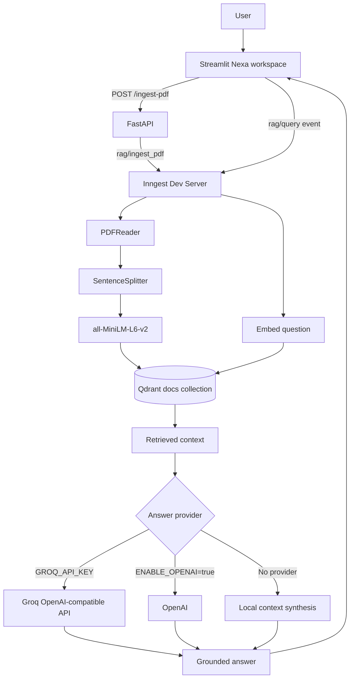

# AI Knowledge Workspace

> Turn your PDF documents into a private, searchable knowledge layer.

AI Knowledge Workspace is a local PDF Retrieval-Augmented Generation (RAG)
application. Upload a PDF from the Streamlit workspace, process it through an
Inngest workflow, store locally generated embeddings in Qdrant, and ask
grounded questions through the same workspace.

The repository currently runs as a local development stack:

- **Streamlit** provides the Nexa knowledge workspace frontend.
- **FastAPI** exposes PDF ingestion and the Inngest SDK route.
- **Inngest** coordinates ingestion and query functions.
- **LlamaIndex** extracts and chunks PDF text.
- **Sentence Transformers** generates local 384-dimensional embeddings.
- **Qdrant** stores and retrieves document vectors.
- **Groq or OpenAI** can optionally generate the final answer; otherwise the
  application uses local context synthesis.

> This repository does not currently define live demo, hosted GitHub, or
> external documentation URLs. Configure those links when the project is
> deployed.

## Badges

[](https://www.python.org/)
[](https://fastapi.tiangolo.com/)
[](https://www.inngest.com/)
[](https://www.llamaindex.ai/)
[](https://qdrant.tech/)
[](https://streamlit.io/)

## Features

- **PDF ingestion** through the Nexa Streamlit frontend or FastAPI endpoint.
- **Event-driven processing** with Inngest functions for ingestion and query
  execution.
- **PDF text extraction and chunking** using LlamaIndex's `PDFReader` and
  `SentenceSplitter`.
- **Local semantic embeddings** using
  `sentence-transformers/all-MiniLM-L6-v2` with 384 dimensions.
- **Vector search** in a local Qdrant collection named `docs`.
- **Grounded question answering** using retrieved document context.
- **Optional answer generation** through Groq or OpenAI-compatible inference.
- **Local fallback synthesis** when no answer-generation provider is enabled.
- **Evidence display** in the frontend using source paths returned by the
  query function.
- **Service health indicators** for FastAPI, Inngest, and Qdrant.
- **Responsive dark workspace UI** with upload, document search, chat, status,
  and knowledge-graph identity elements.

The backend does not currently expose document listing, deletion, page-level
source metadata, or a direct query REST endpoint. The frontend does not invent
those capabilities.

## How It Works

### Ingestion

1. The user selects a PDF in the Streamlit frontend.
2. The frontend writes the selected file to a temporary local path.
3. The frontend calls `POST /ingest-pdf?filename=...`.
4. FastAPI publishes a `rag/ingest_pdf` event to the local Inngest server.
5. The `RAG: Ingest PDF` function:
   - validates the PDF path,
   - extracts PDF text with LlamaIndex,
   - splits text into chunks,
   - creates local embeddings,
   - upserts vectors and payloads into Qdrant.
6. Chunk payloads contain the source identifier and extracted text.

### Query

1. The frontend publishes a `rag/query` event to the local Inngest event API.
2. The `RAG: Query` function embeds the question locally.
3. Qdrant returns the most relevant chunks.
4. The function builds a context block from those chunks.
5. If configured, Groq or OpenAI generates a grounded answer.
6. If no provider is enabled, the function returns a local context-based
   synthesis.
7. The frontend polls Inngest's local GraphQL endpoint for the completed
   function output and renders the answer and returned sources.



## Architecture

| Component | Responsibility |
| --- | --- |
| **Streamlit frontend** | Uploads PDFs, submits query events, polls results, displays documents, status, answers, and sources. |
| **FastAPI** | Hosts the `/ingest-pdf` HTTP endpoint and the Inngest SDK route at `/api/inngest`. |
| **Inngest** | Executes `RAG: Ingest PDF` and `RAG: Query` as durable event-driven functions. |
| **LlamaIndex** | Reads PDF files with `PDFReader` and chunks extracted text with `SentenceSplitter`. |
| **Sentence Transformers** | Generates local `all-MiniLM-L6-v2` embeddings; no embedding API credits are needed. |
| **Qdrant** | Stores vectors in the `docs` collection and performs similarity search. |
| **Groq** | Optional OpenAI-compatible answer-generation provider when `GROQ_API_KEY` is configured. |
| **OpenAI** | Optional answer-generation provider when explicitly enabled; it is not used for embeddings in the current code. |
| **uv** | Resolves, locks, and installs Python dependencies from `pyproject.toml` and `uv.lock`. |

### Local service topology

| Service | URL | Purpose |
| --- | --- | --- |
| FastAPI | `http://localhost:8000` | API, Swagger UI, and Inngest SDK |
| FastAPI SDK | `http://localhost:8000/api/inngest` | Inngest function registration and execution |
| Streamlit | `http://localhost:8501` | Nexa frontend |
| Inngest | `http://localhost:8288` | Event processing dashboard and local event API |
| Qdrant | `http://localhost:6333` | Vector database |

When Inngest runs in Docker and FastAPI runs on Windows, the Docker compose
configuration points Inngest to:

```text
http://host.docker.internal:8000/api/inngest
```

The local `.env` also uses `INNGEST_SERVE_ORIGIN` so generated execution URLs
remain reachable from the container. Do not commit `.env`.

## Tech Stack

| Technology | Purpose |
| --- | --- |
| Python 3.10+ | Application runtime |
| FastAPI | HTTP API and Inngest SDK hosting |
| Streamlit | Nexa knowledge workspace frontend |
| Inngest | Event-driven workflow execution |
| LlamaIndex Core | Text chunking |
| LlamaIndex File Readers | PDF extraction |
| Sentence Transformers | Local semantic embeddings |
| Qdrant Client / Qdrant | Vector storage and similarity search |
| Groq | Optional answer-generation provider |
| OpenAI SDK | Optional OpenAI-compatible answer generation |
| uv | Dependency management and lockfile generation |
| Uvicorn | ASGI development server |

## Project Structure

```text
REG/
├── frontend/
│   ├── __init__.py
│   ├── api.py              # FastAPI, Inngest, and Qdrant client helpers
│   ├── app.py              # Nexa Streamlit workspace
│   └── styles.py           # Frontend styling and command palette
├── src/
│   └── reg/
│       ├── __init__.py
│       └── app.py          # FastAPI app and Inngest functions
├── tests/
│   └── test_app.py         # FastAPI endpoint tests
├── .streamlit/
│   └── config.toml         # Streamlit theme and port
├── custom_types.py         # Pydantic workflow result models
├── data_loader.py          # PDF loading, chunking, and local embeddings
├── docker-compose.yml      # Inngest and Qdrant services
├── main.py                 # Compatibility entry point for uvicorn main:app
├── pyproject.toml          # Project metadata and dependencies
├── uv.lock                 # Locked dependency resolution
├── vector_db.py            # Qdrant store and search helpers
└── README.md
```

Runtime-only files and directories such as `.env`, virtual environments, and
`qdrant_storage/` are excluded by `.gitignore`.

## Requirements

- Windows, macOS, or Linux
- Python 3.10 or newer
- [uv](https://docs.astral.sh/uv/)
- Docker Desktop or another Docker Engine for Inngest and Qdrant
- Network access on first startup to download the Sentence Transformer model
- An optional Groq API key or OpenAI API key if remote answer generation is
  desired

## Installation

Clone the repository and enter its directory:

```powershell
git clone <your-repository-url>
cd REG
```

Create or synchronize the project environment with the lockfile:

```powershell
uv sync
```

On Windows, the repository's documented Python 3.12 environment can be used
directly:

```powershell
uv sync --python .venv312\Scripts\python.exe
```

## Environment Configuration

Create a `.env` file in the repository root. Never commit it or paste secret
values into source control.

The application reads these variables:

| Variable | Required | Purpose |
| --- | --- | --- |
| `INNGEST_EVENT_API_BASE_URL` | No | FastAPI's event publishing origin. Defaults to `http://localhost:8288`. |
| `INNGEST_SERVE_ORIGIN` | Docker setup | Publicly reachable FastAPI origin for Inngest-generated execution URLs. Use `http://host.docker.internal:8000` when Inngest runs in Docker and FastAPI runs on the host. |
| `HOST` | No | FastAPI host used by `reg.app:main`; defaults to `127.0.0.1`. |
| `PORT` | No | FastAPI port used by `reg.app:main`; defaults to `8000`. |
| `GROQ_API_KEY` | No | Enables Groq answer generation when present. |
| `LLM_MODEL` | No | Overrides the configured Groq/OpenAI-compatible model name. |
| `OPENAI_API_KEY` | No | OpenAI credential, used only when OpenAI answer generation is enabled. |
| `OPENAI_BASE_URL` | No | Optional OpenAI-compatible API base URL. |
| `ENABLE_OPENAI` | No | Enables standard OpenAI answer generation when set to `true`, `1`, or `yes`. |
| `QDRANT_URL` | No | Qdrant URL. Use the Qdrant Cloud HTTPS URL in production. |
| `QDRANT_API_KEY` | No | Qdrant Cloud API key. |
| `CORS_ORIGINS` | No | Comma-separated frontend origins allowed to call FastAPI. |
| `INNGEST_ENV` | No | Set to `production` for Inngest Cloud. |
| `UPLOAD_DIR` | No | Directory for temporarily persisted uploaded PDFs. Defaults to `data/uploads`. |

Embeddings are local and use:

```text
sentence-transformers/all-MiniLM-L6-v2
```

The current code does not read an API key for embedding generation.

For a safe starting point, copy `.env.example` to `.env` and fill in only the
values needed by your environment.

## Running the Application

### 1. Start Inngest and Qdrant

```powershell
docker compose up -d
```

Verify the containers:

```powershell
docker compose ps
```

### 2. Start FastAPI

From the repository root:

```powershell
.\.venv312\Scripts\python.exe -m uvicorn reg.app:app --host 0.0.0.0 --port 8000 --reload
```

FastAPI documentation is available at:

```text
http://localhost:8000/docs
```

### 3. Start the Nexa frontend

In a second terminal:

```powershell
.\.venv312\Scripts\python.exe -m streamlit run frontend/app.py
```

Open:

```text
http://localhost:8501
```

## API and Event Contracts

### Queue PDF ingestion

```http
POST /ingest-pdf?filename=<local-pdf-path>
```

Example:

```powershell
$pdf = 'C:\Users\YourName\Downloads\Reading_WHO Building Blocks.pdf'
$encodedPath = [uri]::EscapeDataString($pdf)

Invoke-RestMethod `
  -Method Post `
  -Uri "http://localhost:8000/ingest-pdf?filename=$encodedPath"
```

Successful response:

```json
{
  "event_ids": ["..."],
  "message": "PDF ingestion started"
}
```

The path must be accessible to the FastAPI process. When using the Streamlit
frontend locally, the frontend writes the uploaded PDF to a temporary path
before queueing this request.

The Streamlit frontend uses `POST /upload-pdf` instead when it runs outside
the backend machine. That endpoint stores the uploaded PDF temporarily and
queues the same `rag/ingest_pdf` workflow.

### Query indexed documents

The backend does not expose a direct `/query` REST endpoint. Queries are sent
as the Inngest event `rag/query`.

From the Inngest Dev Server UI, use:

```text
Event name: rag/query
```

```json
{
  "question": "What are the six WHO health system building blocks?",
  "document_id": "<uploaded-document-id>",
  "top_k": 5
}
```

The Nexa frontend submits the equivalent event to the local event API and
polls `/v0/gql` for the completed `RAG: Query` function output.
Queries are rejected unless the selected document has completed ingestion.
Qdrant applies a `document_id` payload filter before similarity search, so
chunks from other uploaded PDFs cannot enter the answer context.

## Inngest Functions

### `RAG: Ingest PDF`

Trigger:

```text
rag/ingest_pdf
```

Steps:

```text
load-and-chunk
embed-and-upsert
```

### `RAG: Query`

Trigger:

```text
rag/query
```

Steps:

```text
embed-and-search
llm-response       # only when Groq/OpenAI is configured
local-synthesis    # fallback when no remote provider is configured
```

## Testing

Run the existing backend tests:

```powershell
.\.venv312\Scripts\python.exe -m unittest discover -s tests -p "test*.py" -v
```

Compile-check the frontend modules:

```powershell
.\.venv312\Scripts\python.exe -m compileall -q frontend
```

The repository currently contains unit tests for:

- rejecting an empty ingestion filename,
- redirecting `/` to `/docs`,
- returning `503` when the Inngest event service cannot be reached.

## Public deployment

The repository includes [`render.yaml`](./render.yaml) for deploying the
FastAPI service to Render. Configure the following in the Render dashboard
using values from your Inngest Cloud and Qdrant Cloud projects:

- `INNGEST_EVENT_API_BASE_URL`
- `INNGEST_SERVE_ORIGIN` (the public Render URL)
- `QDRANT_URL`
- `QDRANT_API_KEY`
- `CORS_ORIGINS` (the Streamlit Community Cloud URL)
- One answer provider: `GROQ_API_KEY`, or `OPENAI_API_KEY` with
  `ENABLE_OPENAI=true`

Deploy `frontend/app.py` as a Streamlit Community Cloud app from the same
repository. Set `RAG_API_URL` to the public Render URL. The frontend also
needs the public Inngest event/query service URL and Qdrant URL if service
status is enabled; set `INNGEST_URL` and `QDRANT_URL` in the Streamlit app
secrets/environment. Never put provider keys in frontend settings.

In Inngest Cloud, register the FastAPI SDK endpoint at:

```text
https://<render-service-domain>/api/inngest
```

The deployment is not complete until `/healthz`, `/api/inngest`, PDF upload,
Inngest ingestion, Qdrant retrieval, and a real question have all been
verified. The service has no authentication layer, so add authentication and
rate limiting before exposing sensitive documents publicly.

## Troubleshooting

### `Unable to reach SDK URL`

Check that FastAPI is running on port `8000` and that the SDK endpoint
responds:

```powershell
Invoke-WebRequest http://localhost:8000/api/inngest
```

It should return HTTP `200`.

When Inngest runs in Docker, ensure both of these are true:

- `docker-compose.yml` uses
  `http://host.docker.internal:8000/api/inngest`.
- `.env` contains:
  `INNGEST_SERVE_ORIGIN=http://host.docker.internal:8000`.

Restart FastAPI and the Inngest container after changing the origin.

### Query fails because `question` is empty

The event payload must include a non-empty `question`:

```json
{
  "question": "Summarize the indexed document.",
  "top_k": 5
}
```

### OpenAI quota errors

OpenAI is optional in the current implementation and is not used for
embeddings. If `ENABLE_OPENAI=true` and the configured OpenAI account has no
credits, answer generation can fail. Disable OpenAI, configure Groq, or leave
both remote providers unset to use local context synthesis.

### Qdrant vector dimension mismatch

The current local embedding model produces 384-dimensional vectors. The
`QdrantStore` checks the `docs` collection dimension and recreates the
collection if it does not match. Re-ingest documents after a collection
recreation.

## Security and Privacy

- Keep `.env` out of version control.
- Never expose API keys in the frontend or browser code.
- Do not commit `qdrant_storage/` or local model/cache credentials.
- The local embedding path does not send document text to an embedding API.
- If Groq or OpenAI is configured, retrieved context may be sent to that
  provider for answer generation.
- The current local development API does not implement authentication or
  authorization. Add an authentication layer before exposing it publicly.

## License

No license file or license declaration is currently present in the repository.
Add a license before publishing the project for external reuse.

## Roadmap

Potential production hardening areas that are not currently implemented:

- authenticated users and workspaces,
- persistent document metadata and processing history,
- document deletion and collection management,
- page-aware source citations,
- a dedicated query API instead of frontend polling through Inngest,
- production deployment configuration,
- automated CI and coverage reporting,
- rate limiting and request authorization.
